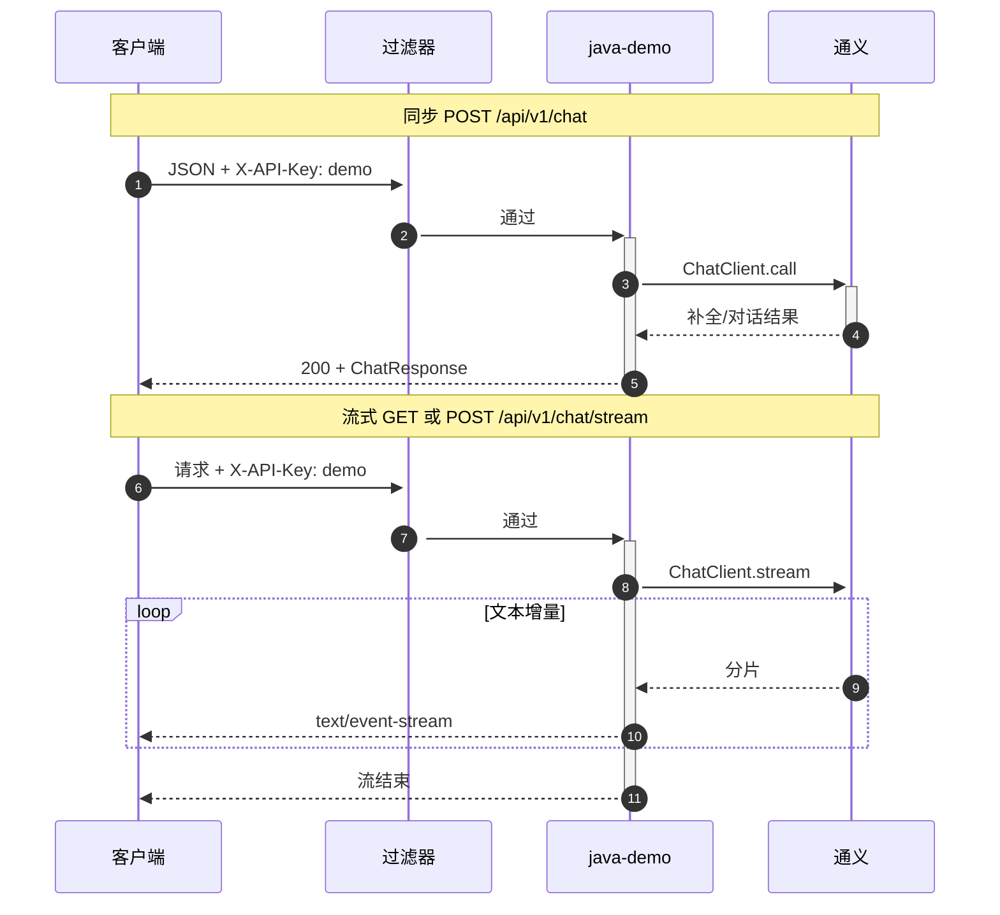
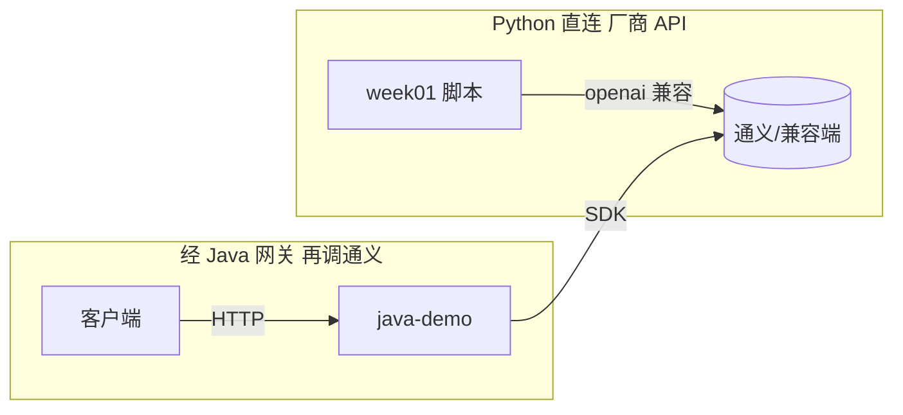
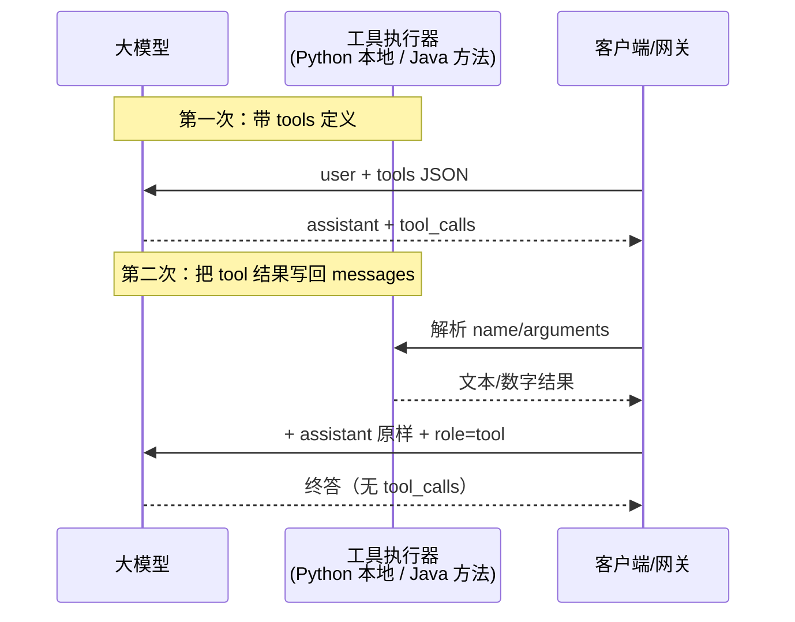

# 第 1 周：大模型应用地图与 API 设计

> 约 **5～7 个学习日**（按每日 3～6h 计）。**先 Python 跑通，再 Java 做对外形态。**

## 本周目标

- 在脑中建立**应用地图**：补全 / 多轮对话 / 流式 / **Function Calling（工具）** 与纯对话的**多轮差异**（FC 本周**选做**最小闭环，**第 6 周**双端必做）。
- Python：**同步 + 流式** 各一套；能打印**首 token 时间**与总耗时。
- Java：提供 `POST` 与 **SSE**（或分块 `text/event-stream`）转发；Controller 有**鉴权占位**（如 `X-API-Key` 头，假校验通过）。

## 与「流行」技术的关系（本周落点）

| 名词                       | 本周要掌握到什么                                                                                              |
| ------------------------ | ----------------------------------------------------------------------------------------------------- |
| **Function Calling**     | **选做**：Python 用 API 带 `tools`，走通 **tool_calls → 执行 → role=tool 回注 → 终答**；建立和「没有 tools 的多轮」的**对比感**即可。 |
| **ReAct / MCP / Skills** | **不新写大作业**；读 `[流行技术索引](./流行技术索引-ReAct-FunctionCalling-MCP-Skills.md)` **5 分钟**，知道第 6 周会集中做。           |

## 核心概念速记（本周末能复述即可）

- **首 token 延迟**（用户体感）、**总时长**、**Timeout**、**重试** 四者区别。
- 流式时：客户端断开 / 服务中途异常时，**是否**要停止上游生成（可简化为只打日志，第 1 周不强制实现）。

## 按日计划

### 第 1 天：Python 同步 + 参数

- 阅读所使用 SDK 的 **chat/completions** 或 Messages API 基本参数（`model`, `temperature`, `max_tokens`）。
- 实现：`chat(message: str) -> str`，含 **3 次超时** 配置（如 30s/60s/120s 试一次即可）。
- 记录：请求起止时间、返回字符数（估算 token 可下周再精确）。

> **本仓库参考实现**：`[monorepo-py/scripts/week01_day1_sync_chat.py](../../monorepo-py/scripts/week01_day1_sync_chat.py)`（含中文注释；在 `monorepo-py` 下执行 `python scripts/week01_day1_sync_chat.py`）。说明见 `[monorepo-py/week01/README.md](../../monorepo-py/week01/README.md)`。

### 第 2 天：Python 流式 + 首 token

- 实现 `stream_chat(messages) -> generator`，在控制台**逐字或逐段**打印。
- 在代码里用 `time.perf_counter()` 记录**第一次 yield** 前耗时 = 首 token 延迟。
- 写 2～3 行笔记：你用的模型首 token 大致多少 ms（仅作自测，不与人比较）。

> **本仓库参考实现**：`[monorepo-py/scripts/week01_day2_stream_chat.py](../../monorepo-py/scripts/week01_day2_stream_chat.py)`（`stream_chat` 生成器、`time.perf_counter()` 计首段延迟；`week01/day2_首token自测.md` 可手补模型名与网络）。在 `monorepo-py` 下执行 `python scripts/week01_day2_stream_chat.py`。说明见 `[monorepo-py/week01/README.md](../../monorepo-py/week01/README.md)`。

### 第 3 天：Java 同步接口

- 定义 DTO：`ChatRequest`（`messages` 或 `prompt` 二选一简版）、`ChatResponse`。
- 实现 `POST /api/v1/chat`：先 **同步** 调模型，**优先** 使用 **Spring AI Alibaba** 的 `ChatClient`（或官方示例的等价类名）；**仅当** 官方路径不通时，**临时** 用 `RestClient` 直调 OpenAI 兼容端点作对照，**并在** `README` 注清**为何** 绕开，避免长期两套并存。
- 统一异常：`4xx/5xx` 返回体含 `code`, `message`（不泄露 key）。

> **本仓库参考实现**（`POST /api/v1/chat`、DTO、`ChatClient` 同步、统一错误体）：见 `[monorepo-java/java-demo/](../../monorepo-java/java-demo/)` 下 `com.aimodel.javademo.api.dto`、`com.aimodel.javademo.service.ChatLlmService`、`com.aimodel.javademo.web.ChatV1Controller`、`com.aimodel.javademo.config.GlobalExceptionHandler`；说明与 `curl` 见 `[monorepo-java/java-demo/README.md](../../monorepo-java/java-demo/README.md)`。主路径为 **Spring AI `ChatClient` + 阿里云 DashScope `ChatModel`**，未再写 `RestClient` 直调，避免与课表第 3 天「两套路由长期并存」冲突。

### 第 4 天：Java 流式 / SSE

- 实现 `GET` 或 `POST` 的 **SSE** 流式返回（`MediaType.TEXT_EVENT_STREAM`），下游若 SDK 不友好可先 **分块从 Python 子进程/HTTP 代理**（本周末推荐 **直连** 为优）。
- 浏览器或 `curl -N` 能连续收到事件。
- 流式与同步**共用**同一套配置（`model`, `baseUrl`, `apiKey`）。

> **本仓库参考实现**：`GET` 与 `POST` 的 `**/api/v1/chat/stream`**，`produces = TEXT_EVENT_STREAM`，`ChatClient#stream#content` → `Flux` → `SseEmitter`；`meta` / `delta` / `done` / `error` 事件。说明与 `curl -N` 见 `[monorepo-java/java-demo/README.md](../../monorepo-java/java-demo/README.md)`。**直连** DashScope，未用 Python 子进程代理，与 `POST /api/v1/chat` 共用 `spring.ai.dashscope`。

### 第 5 天：鉴权占位 + 简单限流（可选）

- 请求头 `X-API-Key: demo` 时放行，缺省 401（占位即可）。
- 可选：Guava `RateLimiter` 或内存计数，单 IP/单 key 每分钟 N 次（N 可小）。

> **本仓库参考实现**：`Filter` 校验 `**X-API-Key: demo`**（`APP_EXPECTED_API_KEY` 可覆盖），白名单 /api/v1/health/**、`/error`；内存**滑动窗口**按 **IP** 每分钟 30 次，HTTP **429** + `code: RATE_LIMITED`。`ASYNC` 二次分派不重复计次（避免 SSE 双重限流）。类名见 `ApiKeyAndRateLimitFilter`、`SlidingWindowRateLimiter`；见 `[monorepo-java/java-demo/README.md](../../monorepo-java/java-demo/README.md)` 的 `app.security` / `app.rate-limit` 与 `curl` 头示例。

### 第 6 天：时序图 + 联调

- 用 **Mermaid 或手画** 一张图：客户端 → 你的 Java 网关 → 大模型；注明同步/流式各一条路径。
- 双端各保留 **1 条** `curl` 示例，贴进 `README` 的「第1周」小节。

> **本仓库落地**：Mermaid 见下**两图**；根目录 `[README`「第1周联调与验收」`#week1-acceptance](../README.md#week1-acceptance)` 为 **Python 一条命令 + Java 一条 `curl`**（「双端各一条」：Python 为直连、非 `curl`）。

#### 时序图（Mermaid，客户端 → `java-demo` 网关 → 通义）

支持 Mermaid 的查看器中可见（如 GitHub、IDE 预览）。**同步**与**流式**各一条主路径；第5天起业务请求在进 `Controller` 前经**过滤器**校验 `X-API-Key` 与按 IP 限流。探活 `GET /api/v1/health/`** 不经过此对话链路（白名单）。

**对照图（Python 直连 与 经 Java 网关）**：

### 第 7 天：复习与本周收尾

- 本目录笔记：「补全 vs 多轮」各举一个业务例子（可虚构）。
- **选做 FC 小结**：若完成了 `tools` 最小闭环，用 5 行写清「**第二次**请求前我拼进了哪些 `messages`」。
- 代码提交一版 tag：`week01`（可选）。

> **本仓库落地**  
>
> - **笔记模板**（补全 vs 多轮 + FC 小结）：`[monorepo-py/week01/day7_本周收尾与FC.md](../../monorepo-py/week01/day7_本周收尾与FC.md)`（可**复制**后手写补充，勿提交隐私）。  
> - **Python FC**：`[monorepo-py/scripts/fc_min.py](../../monorepo-py/scripts/fc_min.py)`（手搓多轮 `messages`：`user` → `assistant+tool_calls` → `tool` → 再请求）。  
> - **Java FC**：`POST /api/v1/fc/chat`，`Week01DemoTools` + `ToolCallingChatOptions` + `internalToolExecutionEnabled(true)`；说明与 `curl` 见 `[java-demo/README](../../monorepo-java/java-demo/README.md)`。通义建议 `**qwen-plus`** 等支持 tools 的模型（`LLM_MODEL` / `spring.ai.dashscope.chat.options.model`）。

#### FC 小图（模型 ↔ 工具执行器，Mermaid）

#### 「补全 vs 多轮」笔记样例（虚构，可直接改两句交作业）

| 类型     | 业务例子（虚构）                                                                              |
| ------ | ------------------------------------------------------------------------------------- |
| **补全** | 用户在代码编辑器里选中函数名，IDE 只发**当前这一条** `user`（+ 可选 system），模型**续写**下一行，不保留昨天对话。               |
| **多轮** | 客服机器人已记 3 轮 `user/assistant`，用户追问「那方案 B 呢？」，请求体里必须**拼上历史 messages**，否则模型不知道「方案 B」指什么。 |

#### FC 小结（**第二次**请求前 `messages` 里多了什么，5 行以内）

1. 仍含**第一次**的 `user`。
2. 紧接一条 `**assistant`**，且必须带模型返回的 `**tool_calls**`（含 `id`，与下面 `tool` 一一对应）。
3. 每条被调用的工具对应一条 `**role: "tool"**`，`tool_call_id` 填上，`content` 为**本机执行**结果字符串。
4. **没有**再发一次 `tools` 定义也能继续（多数实现仍可在后续轮带 `tools`）。
5. 直到某次返回的 `assistant` **没有** `tool_calls`，该条里的 `content` 即终答。

## 周产出物

- 1 张时序图（图或代码均可）；**若做 FC**：**另 1 张**「模型 ↔ 工具执行器」小图（**本仓库**：见上节 Mermaid「FC 小图」）。
- `README`：同步与流式各一条调用示例（Python 命令行 + `curl` Java）；**FC**：见 `[scripts/fc_min.py](../../monorepo-py/scripts/fc_min.py)` 与根 `[README` 第1周](../../README.md#week1-acceptance) 或 `java-demo/README`。

## 完成标准

- 能向面试官用 **1 分钟** 说清：为何线上常要 **流式**、**timeout** 设多大如何权衡（结合你自测数据）。

## 与第 2 周衔接

第 2 周在请求体里会加 **system prompt、结构化 JSON**；本周接口形态尽量**稳定**，少改 URL。

## 选做扩展

- 对接 **OpenAI 兼容** 的 `response_format` 预告（不实现，只读文档）。

